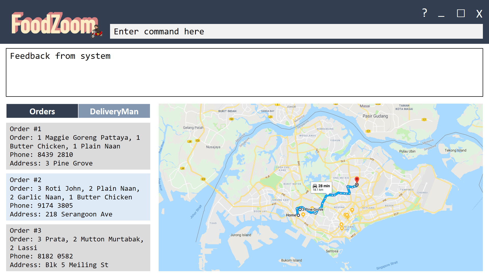

= FoodZoom
ifdef::env-github,env-browser[:relfileprefix: docs/]

https://travis-ci.org/CS2103-AY1819S1-T16-3/main[image:https://travis-ci.org/CS2103-AY1819S1-T16-3/main.svg?branch=master[Build Status]]
https://ci.appveyor.com/project/juxd/main/branch/master[image:https://ci.appveyor.com/api/projects/status/bv2mp10bqjo93700/branch/master?svg=true[Build status]]
https://coveralls.io/github/CS2103-AY1819S1-T16-3/main?branch=master[image:https://coveralls.io/repos/github/CS2103-AY1819S1-T16-3/main/badge.svg?branch=master[Coverage Status]]
https://gitter.im/se-edu/Lobby[image:https://badges.gitter.im/se-edu/Lobby.svg[Gitter chat]]

ifdef::env-github[]

endif::[]

ifndef::env-github[]
image::images/Ui.png[width="600"]
endif::[]

Welcome to FoodZoom! FoodZoom is a desktop food delivery management application designed for food businesses to streamline their delivery process. FoodZoom is responsive and quick, allowing managers to plan routes for order delivery and dispatch them to delivery men using a Command Line Interface (CLI). The delivery men can also use this application to view their delivery routes and increase their efficiency.

Make your food delivery system more seamless today with FoodZoom!

== Site Map

* <<UserGuide#, User Guide>>
* <<DeveloperGuide#, Developer Guide>>
* <<AboutUs#, About Us>>
* <<ContactUs#, Contact Us>>

== Acknowledgements

* Some parts of this sample application were inspired by the excellent http://code.makery.ch/library/javafx-8-tutorial/[Java FX tutorial] by
_Marco Jakob_.
* Libraries used: https://github.com/TestFX/TestFX[TextFX], https://bitbucket.org/controlsfx/controlsfx/[ControlsFX], https://github.com/FasterXML/jackson[Jackson], https://github.com/google/guava[Guava], https://github.com/junit-team/junit5[JUnit5]
* AddressBook-Level4 project is created by SE-EDU initiative at https://github.com/se-edu/
* Icons used in this application are made by Freepik from https://www.flaticon.com

== Licence : link:LICENSE[MIT]
